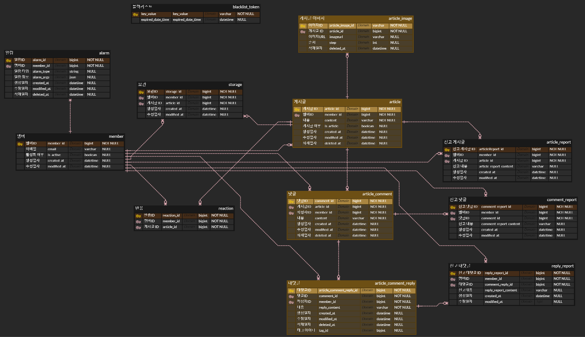
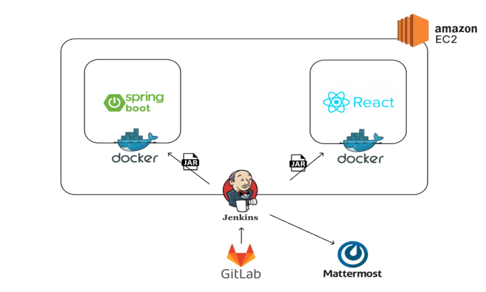
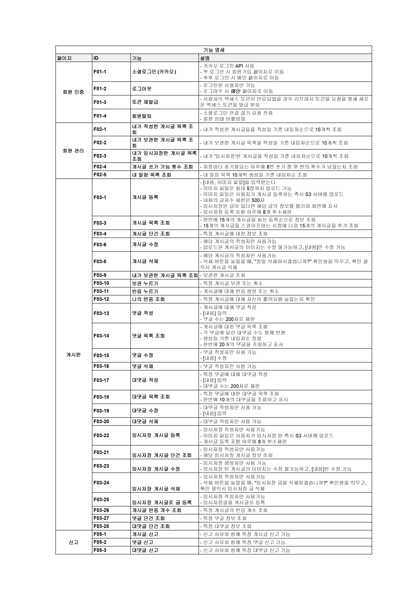
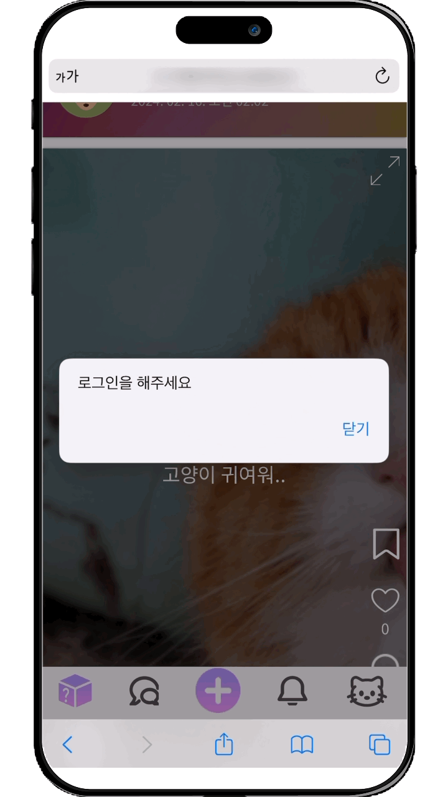

<h4> 누구나 부담없이 사용하는 익명 글 공유 서비스 </h4>
<h3> 판도라의 숲 </h3>

## ✅ 프로젝트 진행 기간

### 2024.01.08 ~ 2024.04.16(6주)

## **✅ 프로젝트 소개**

**🚩 서비스 한줄 소개**

`익명 글 공유 서비스
"개시글을 작성할 때 마다 랜덤닉네임 부여, 팔로워/팔로잉을 신경쓰지 않아 부담없는 글 공유 SNS 서비스 '판도라의 숲'"`

**🚩 기획 배경**

- 자신의 사소하고 비밀스러운 이야기를 공유하고 공감받고 싶어하는 사용자가 많지만  기존의 SNS는 고정된 닉네임을 사용하거나 주변 사람들과 ID를 공유하며 사용하기 때문에 완벽한 익명성을 보장하기 힘들다고 생각했습니다.
- 또한 기존의 SNS는 자신의 팔로우 하는 사람이 많을수록 소통이 더 잘 이루어지고, 해당 플랫폼에 영향을 많이 끼치고 있습니다.
- 따라서 저희는 자신의 이야기를 공유하고 공감받고 싶어하는 사용자가 부담없이 사용할 수 있도록 글 마다 랜덤닉네임을 부여하고 팔로우/팔로워가 없는 글 공유 플렛폼을 만들고자 합니다.

**🚩 기술 스택**
|  | skills |
| --- | --- |
| Backend |    |
| Frontend |    |
| Infra |     |
| 협업 툴 |     |
| 디자인 |  |

## **✅ 프로젝트 설명 및 특장점**

- 공유하고 싶은 글을 원하는 사진과 함께 공유할 수 있고, 공유된 글과 사진들을 숏츠형식으로 편하게 확인할 수 있습니다.
- 원하는 게시글에 좋아요와 댓글, 대댓글을 달 수 있습니다.
- 마음에 드는 게시글을 보관 버튼을 통해 보관하고 마이페이지에서 보관한 글을 다시 확인할 수 있습니다.
- 글을 작성하던 도중 임시저장을 할 수 있으며 다음에 다시 작성하고 싶을때 임시저장글을 불러와 다시 작성할 수 있습니다.
- 게시글을 작성할 때 마다 새로운 닉네임이 랜덤으로 부여되며, 댓글 또한 게시글 별로 랜덤 닉네임이 부여됩니다.
- 마이페이지에서 보관한 글과 내가 작성한 글을 확인할 수 있습니다.
- 내 글에 좋아요, 댓글, 대댓글이 달렸을 때 알림을 받을 수 있습니다.

**🚩 프로젝트 확장성**

판도라의 숲을 더욱 개선된 서비스로 발전시키기 위해 두 가지 확장성 또한 고려할 수 있습니다.

- 쇼츠 알고리즘 개선
    - 사용자가 증가하게 되면 사용자가 주로 관심있어 하는 글의 데이터를 수집하고 분석하여 알고리즘을 개선한다면 맞춤 컨텐츠 제공이 가능합니다.
- 성별 또는 연령대 별 게시판 생성
    - 성별 또는 연령대 정보를 수집해 해당 성별 또는 연령대의 사용자들이 작성한 게시글을 볼 수 있도록 함으로써 사용자가 더 관심 가질만한 게시글을 확인할 수 있습니다.

## ✅ 산출물

 ERD 

 시스템 아키텍처 

 기능 명세서

 와이어 프레임 

[와이어 프레임 링크](https://www.figma.com/design/4yc4GtoT9B4qryWfcK7Scu/%ED%8C%90%EB%8F%84%EB%9D%BC%EC%9D%98-%EC%88%B2?node-id=0-1)

 API 명세서

[API 명세서 링크](https://pumped-square-544.notion.site/API-deac3f36a1ad4c68ac427c155cb63c1e)

## ✅ 기능 소개

### 1. 회원가입 및 로그인 🧑👩

| GIF | 설명 |
| :---: | :--- |
|  |**회원가입 없이 게시글 조회**      - 회원가입 없이도 게시글을 구경 할 수 있다. - 댓글, 좋아요, 보관 기능을 사용하기 위해서는 로그인이 필요하다.     **로그인**   - 카카오 로그인 API를 이용한다. - 첫 로그인을 하면 자동으로 회원가입이 되며 이후 로그아웃 또는 회원탈퇴가 가능하다.|

### 2. 게시글 조회, 좋아요, 보관하기 📄

| GIF | 설명 |
| :---: | :--- |
|  |**게시글 조회**      - 무한스크롤을 통한 숏츠 형식으로 게시글이  조회된다. - 게시글 내용, 사진, 프로필사진, 닉네임, 작성일자, 보관유무, 좋아요 유무, 좋아요 개수, 댓글 개수 등을 알 수 있다. - 게시글의 오른쪽 위 사진확대 아이콘을 클릭하면 함께 등록된 사진들을 확인할 수 있다. - 부적절한 게시글은 신고버튼을 통해 신고할 수 있다.    **게시글 좋아요**      - 공감 가는 게시글은 좋아요 버튼을 통해 좋아요 수를 증가시킬 수 있다.    **게시글 보관**     - 마음에 드는 게시글은 책갈피 버튼을 클릭해 보관할 수 있다. - 보관된 게시글은 마이페이지에서 확인할 수 있다.|

### 3. 게시글 등록, 수정, 삭제, 임시저장

| GIF | 설명 |
| :---: | :--- |
|  |**게시글 등록**      -글 내용 및 이미지를 등록할 수 있다. - 이미지는 최대5장까지 가능하며 글은 500자로 제한되어있다. - 게시글을 등록할 때 마다 새로운 닉네임과 프로필 사진이 랜덤으로 배정된다.    **게시글 수정**      - 자신이 작성한 글을 수정할 수 있다. - 글은 500자로 제한되어있다.    **게시글 삭제**    - 자신이 작성한 글을 삭제할 수 있다.    **게시글 임시저장**     - 작성하던 게시글을 임시저장 하고 원할때 다시 불러올 수 있다.  - 이미지도 함께 임시저장 할 수 있다.|

### 4. 댓글 및 대댓글

| GIF | 설명 |
| :---: | :--- |
|  |**댓글**      - 게시글 마다 자신의 닉네임과 프로필 사진이 랜덤으로 배정되어 댓글이 작성된다. - 댓글을 달면 게시글을 쓴 작성자에게 알림이 간다. - 부적절한 댓글은 신고버튼을 통해  신고가 가능하다. - 자신이 작성한 댓글은 수정 및 삭제가 가능하다.    **대댓글**      - 이미 작성되어 있는 댓글에 대댓글을 달 수 있다. - 대댓글을 달면 이전 댓글의 작성자에게 알림이 간다. - 부적절한 대댓글은 신고버튼을 통해  신고가 가능하다. - 자신이 작성한 대댓글은 수정 및 삭제가 가능하다.|

### 5. 마이페이지

| GIF | 설명 |
| :---: | :--- |
|  |**내가 작성한 글**      - 내가 작성한 게시글들을 작성일 기준 내림차순으로 조회할 수 있다. - 글 내용, 사진, 작성일자, 좋아요 수,  댓글 수를 확인할 수 있다.    **내가 보관한 글**      - 내가 보관한 게시글 목록을 날짜 기준 내림차순으로 조회할 수 있다. - 글 내용, 사진, 작성일자 작성자 닉네임을 확인할 수 있다.|

## ✅ 멤버 소개

| 김성재 | 안성재 | 윤정인 |
| --- | --- | --- |
| 

 | 

 | 

 |
| 
backend
| 
backend
 | 
backend
 |
| - 회원인증(소셜로그인, 토큰 인증) - 자동배포 파이프라인 구축 - 해시함수를 활용한 랜덤 닉네임 부여 로직 개발 | - 게시글 댓글, 대댓글 기능 구현  - 게시글 작성시 이미지 아마존 S3로 업로드 - 알람 기능 구현 | - 게시글 작성, 수정, 삭제, 조회 - 게시글/댓글/대댓글 신고 및 좋아요, 보관기능 - 내가 작성/보관/임시저장한 게시글 목록 조회 |
| 
**조연주**
 | 
**이서윤**
 | 
**유호정**
 |
| 

 | 

 | 

 |
| 
frontend
 | 
frontend
 | 
frontend
 |
| - 게시글 등록 및 이미지 업로드 구현 - 댓글, 대댓글 기능 구현 - 알림페이지 구현 - 랜덤 프로필 사진 배정 구현 | - 메인페이지 및 무한스크롤 구현 - 좋아요 및 보관기능 구현 - 소셜 로그인 - 댓글 모달창 구현 | - 마이페이지, 작성/보관 글 구현 - 게시글/댓글/대댓글 신고 구현 - 게시글 수정 및 임시저장 구현 |
